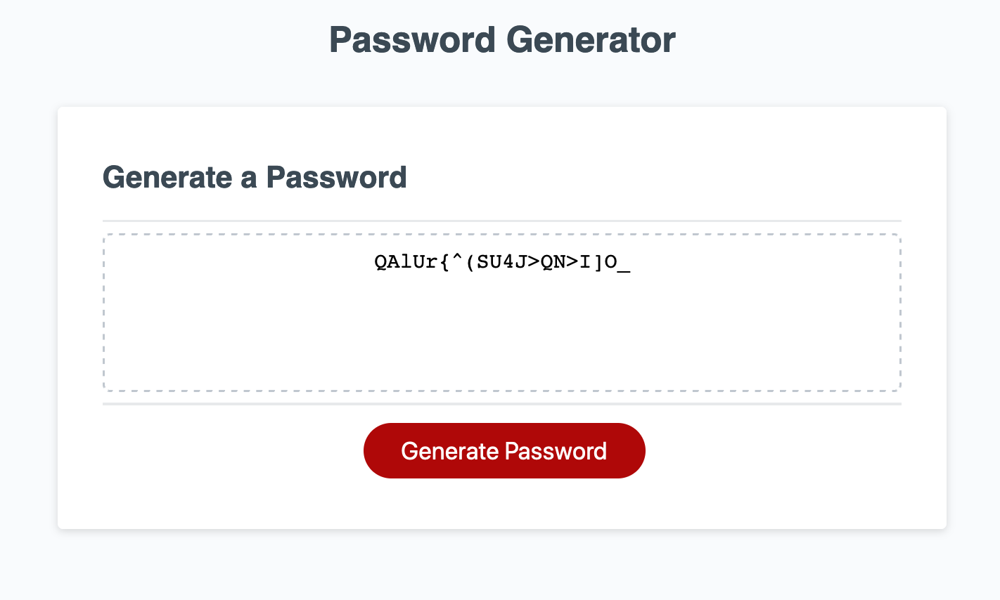

# 3-Password-Generator
NU BC HW 3: Password Generator

Password generator written in Javascript
Generates a password of chosen characters (lowercase, uppercase, numeric, and special) and a user determined length (between 8-128 characters)

